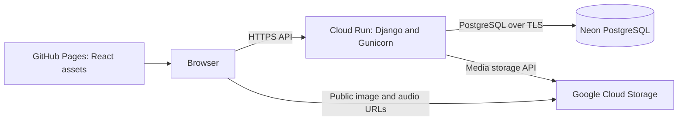

# Story Filler — infrastructure and delivery case study

A Māori vocabulary application used to explore container delivery, Kubernetes, and a move to managed cloud services. Originally a course project, it now provides a recent, hands-on infrastructure example alongside my professional experience in enterprise environments.

**[Application URL](https://jothep.github.io/story-filler/)** · **[Engineering case study](docs/engineering-case-study.md)** · **[Local platform lab](docs/local-platform-lab.md)** · **[Verification record](docs/verification.md)**

## Start here

This is the `jothep/story-filler` publication repository. It carries forward 185 sanitised historical commits plus four preparation commits: a 189-commit migration baseline. The [migration record](docs/repository-migration.md) separates new-repository checks from evidence collected in the former private repository.

For a short review, read the [case study](docs/engineering-case-study.md): the constraints, decisions, trade-offs, and boundaries of what has been demonstrated. The source and dated evidence are linked throughout.

The application provides stories with drag-and-drop vocabulary, illustrations, pronunciation audio, and Django administration. Its value as a portfolio project is the infrastructure around that workload: choosing an appropriate operating model, separating persistent state from compute, and making delivery repeatable.

## Current deployment



- **Frontend:** React/Vite, built and published through GitHub Pages artifacts.
- **Backend:** a non-root container on Cloud Run, with Gunicorn and WhiteNoise.
- **Persistent state:** PostgreSQL on Neon; public learning media in GCS.
- **Infrastructure:** Terraform manages Cloud Run, its runtime service account, Artifact Registry, and public invocation permission. Other setup dependencies remain outside this Terraform configuration.
- **Capacity choice:** Cloud Run is configured for **0–1 instances**, 1 vCPU and 512 MiB. This limits idle compute and scaling exposure for a small demonstration workload; cold starts and a low capacity ceiling are accepted trade-offs.

The [production architecture](docs/architecture-production-gcp.md) explains the live path. The local environments below show the development and orchestration work that preceded and supports it.

## Local engineering practice

These environments serve different purposes. The [local platform lab](docs/local-platform-lab.md) links their implementation, startup order and verification limits.

| Environment | Engineering work it exposes | Evidence boundary |
| --- | --- | --- |
| Development Compose | Source mounts and hot reload, service discovery, a shared Nginx entry point, separate database/media volumes, database readiness before application startup | Configuration reviewed; full container startup not revalidated in this review |
| Local Kubernetes | Deployments and Services, a PostgreSQL StatefulSet/PVC, media persistence, separate migration/admin Jobs, Secret references and a diagnostic Pod | Manifests in `Infra/` and the original migration account; cluster execution not repeated here |
| Production-style Compose | A multi-container, single-host packaging option with Gunicorn, static serving and a reverse proxy | An alternative implementation, not the current hosted service; HTTPS and recovery are not demonstrated |
| Earlier demo | A separate Django/MUI prototype with a story-list/full-text API, before the main application's paragraph and word-bank design | Preserved in `demo/`; its Compose file runs only PostgreSQL, and it is not a miniature copy of current production |

The Kubernetes work demonstrates practical concerns around state, network routing and operational tasks. The later managed-service deployment shows how the operating model changed for a small public workload; both stages are part of this case study.

## Engineering decisions worth reviewing

| Decision | Why it matters | Source and limitation |
| --- | --- | --- |
| Move database and media outside the application container | Container replacement does not require carrying local content between instances | [Storage configuration](backend/maori_story_project/settings.py); restore procedures have not been demonstrated |
| Give Terraform and application delivery different responsibilities | Terraform maintains service configuration; CI selects the application image | [Terraform lifecycle rule](terraform/main.tf), [backend workflow](.github/workflows/deploy-backend.yml); the image field is excluded from Terraform drift reconciliation |
| Publish the frontend independently | Static hosting removes a continuously running frontend service | [Pages workflow](.github/workflows/deploy-frontend.yml); the API URL is a build-time setting |
| Use a multi-stage, non-root backend image and SHA-tagged releases | Separate build tools from runtime and associate a release with source | [Dockerfile](backend/dockerfile); a SHA tag is not a digest-pinning or provenance guarantee |
| Verify the release and keep credentials out of source | Make publication and delivery checks explicit | [Secret scan](.github/workflows/secret-scan.yml), [API smoke check](scripts/smoke-check.py); see dated execution status below |

## What has actually been demonstrated

The [verification record](docs/verification.md) separates **implemented**, **deployment verified**, and **planned** work.

- **Pre-migration deployment verified, 27 September 2026:** the public frontend rendered a story; story/configuration APIs, sampled GCS media, and administrator login worked. The updated frontend and backend pipelines subsequently completed deployment, including the backend's image scan and public API smoke check.
- **Implemented:** Terraform configuration, Kubernetes manifests, backend and frontend delivery workflows, basic automated tests, image scanning, and CodeQL configuration.
- **Publication migration:** credentials were rotated and reachable Git history was cleaned. The former repository remains private because old commit content was still retrievable there. This new repository starts from the cleaned baseline; old Actions runs and aggregate counts are historical evidence, not new-repository runs. See the [migration record](docs/repository-migration.md) for acceptance status.
- **CI authentication:** the backend workflow retains the existing service-account JSON key method through the `GCP_CREDENTIALS` GitHub Actions secret. The owner configures that secret manually in the new repository; this migration does not change the authentication model. New-repository execution evidence is recorded separately from the old runs.
- **Not demonstrated:** sustained availability or latency targets, load capacity, automatic rollback, database restore drills, a complete observability system, or a reproducible billing total of zero.

Backend tests use SQLite, not Neon. Frontend tests mock HTTP and audio. Backend lint and CodeQL analysis are currently advisory; Trivy blocks fixable HIGH/CRITICAL findings. The secret scan is a separate workflow, not a dependency of the deployment job. These checks do not establish that the system has no vulnerabilities.

## Read the story

1. [Original Medium article: the migration from local Kubernetes to managed services](https://medium.com/@shelldry325/from-on-premises-kubernetes-to-zero-cost-serverless-architecture-a-practical-guide-to-cloud-70e68304e835).
2. [Follow-up article draft: operating the migration](docs/articles/02-operating-the-migration.md). This continues the first article's delivery and security theme; it is not yet published on Medium.
3. [Architecture and historical implementation index](docs/ARCHITECTURE.md).
4. [Legacy delivery-history snapshot](docs/evidence/README.md): 198 retained Actions runs across 132 source commits, comprising 126 successes and 72 failures. These count workflow runs in the former repository, not deployments or activity in this repository.

The original article's “zero-cost” framing describes the project's cost objective. This repository does not claim a verified current monthly bill, unlimited free usage, or enterprise high availability. Older deployment and planning documents are supporting historical material; use the current architecture and verification record for current claims.

## Explore locally

Docker with Compose is required for this development path. It uses a separate local PostgreSQL database and local media storage. This startup path still needs a fresh container run, including the non-root user's write access to source mounts and media volumes; see the [local lab's reproduction gaps](docs/local-platform-lab.md#local-filesystem-permissions).

```bash
python3 scripts/init-local-env.py
docker compose -f docker-compose.dev.yml up --build
```

The generator creates an ignored `.env` with random local credentials and refuses to overwrite an existing file. Open `http://localhost/story-filler/` after the services start. A fresh database contains no stories; create an administrator and add content:

```bash
docker compose -f docker-compose.dev.yml exec backend python manage.py createsuperuser
```

Enter credentials interactively, then use `/admin/`. Production credentials and private backups are not part of the repository. Compose configuration parsing has been checked; see the verification record for the status of a full container startup.

## Repository map

| Path | Purpose |
| --- | --- |
| [`backend/`](backend/) | Django API, administration, models, and basic tests |
| [`frontend/`](frontend/) | React application, component tests, Pages build |
| [`terraform/`](terraform/) | Current GCP infrastructure configuration and bootstrap boundaries |
| [`Infra/`](Infra/) | Earlier Kubernetes manifests and operational Jobs |
| [`demo/`](demo/) | Separate earlier Django/MUI prototype |
| [`.github/workflows/`](.github/workflows/) | Delivery and security workflows |
| [`scripts/`](scripts/) | Private local configuration generation and public API verification |
| [`docs/engineering-case-study.md`](docs/engineering-case-study.md) | Decisions, alternatives, and evidence for portfolio review |

For security scope and reporting, see [SECURITY.md](SECURITY.md).
