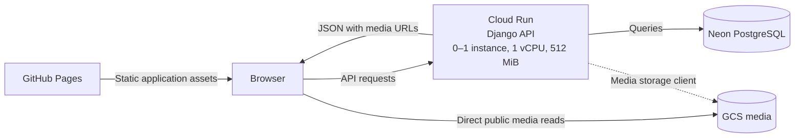
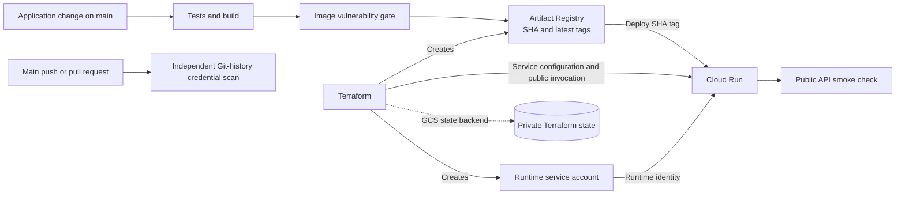
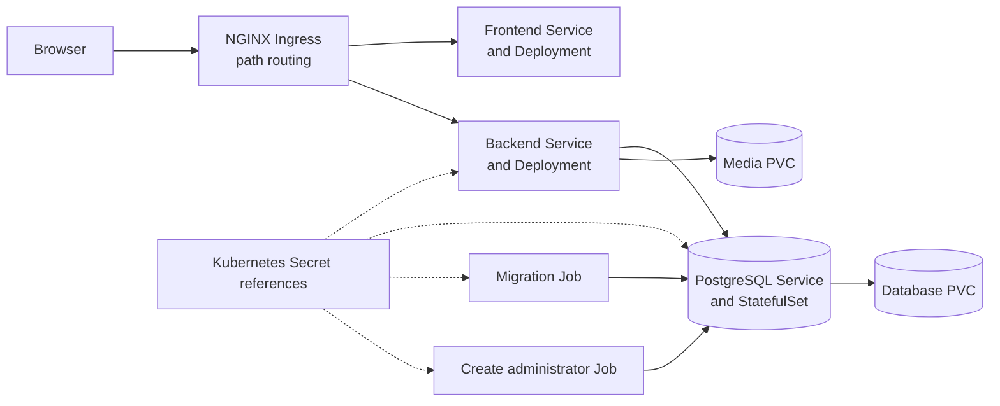

# Architecture diagrams

These diagrams distinguish the current managed deployment from the earlier Kubernetes implementation.
For configuration and evidence limits, read [Current deployment architecture](architecture-production-gcp.md).
For the project stages, read [Architecture overview](ARCHITECTURE.md).
For Compose, local Kubernetes and the prototype, read [Local platform lab](local-platform-lab.md).

## Current managed deployment

The browser is the client of Pages, the API and public media storage.
Pages does not proxy API requests, and ordinary media reads do not traverse Cloud Run.
The dotted storage connection represents the implemented backend integration; the latest online checks did not exercise uploads.
There is no Secret Manager or Workload Identity Federation component in the checked-in deployment configuration.

## Delivery and ownership

This is the backend delivery path; the frontend separately runs lint, tests and build before Pages deployment.
Terraform creates the registry and runtime identity as well as the service configuration, but the application workflow owns image updates.
The GCS state inventory was checked and contains the four declared resources; Terraform formatting and validation passed.
No Terraform plan, apply or restore was performed in this verification; the inventory is not a drift or rebuild check. State may contain sensitive values and is not a public portfolio artifact.
The [backend delivery run for `7d80196`](https://github.com/jothep/maori-story-fill/actions/runs/36299274042) passed application tests, six offline smoke-check tests, image scanning, deployment and the public API smoke check.
Cloud Run revision `maori-story-backend-00027-bzj` serves that commit-tagged image with 100% traffic.
The frontend Pages run for `a309a63` and independent credential scans for both release commits also succeeded; links are in the verification record.
A smoke-check failure does not undo deployment. The credential scan runs independently and does not gate the deployment job.
See the current deployment page and [verification record](verification.md) for exact gates and execution status.

## Historical Kubernetes implementation

This view is grounded in the [checked-in manifests](../Infra/).
Frontend, backend and PostgreSQL each use one replica.
It does not imply load-tested availability, Ingress TLS, autoscaling or a checked-in ArgoCD delivery configuration.
The original article reports a working earlier environment; this review did not recreate it.

The [original Kubernetes illustration](Original%20Kubernetes%20Structure-2026-04-30-232315.png) is preserved as a historical design artifact.
Its TLS/SSL-offloading and frontend/backend health-probe annotations are not supported by the checked-in manifests.
Use the corrected Mermaid view and the qualifications above as the implementation reference; the original image records earlier design intent.
