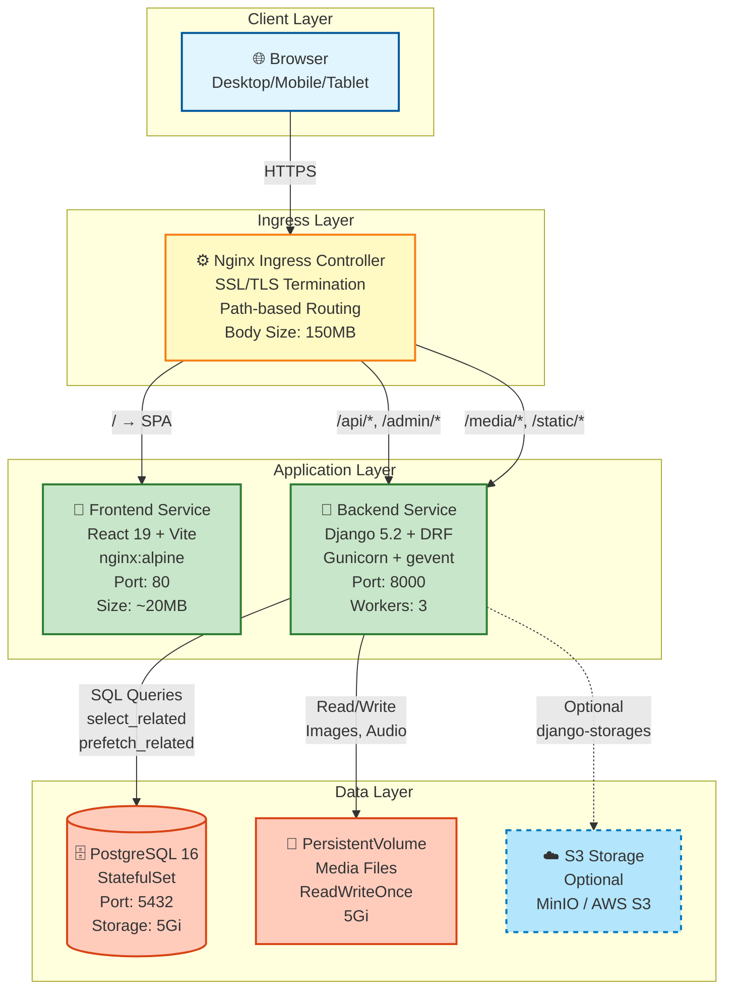
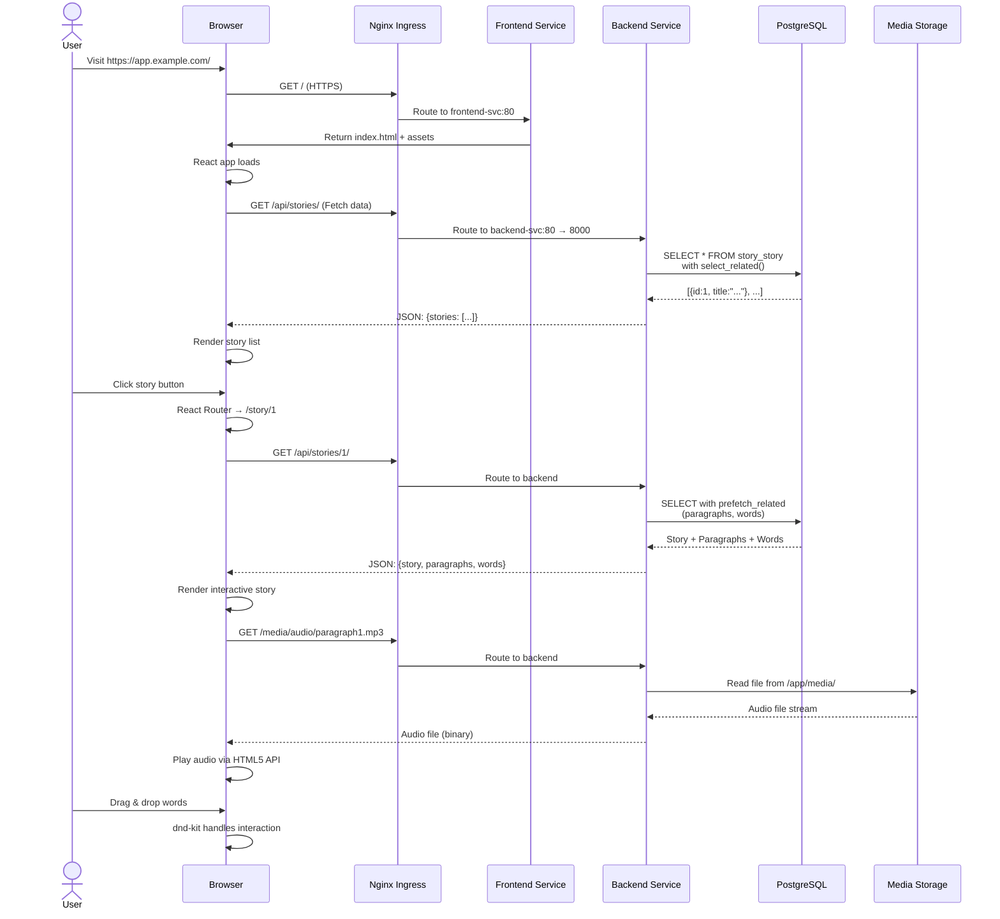
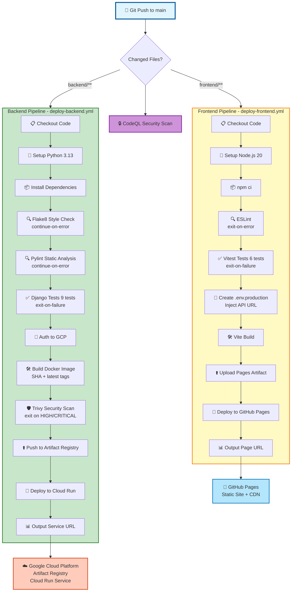
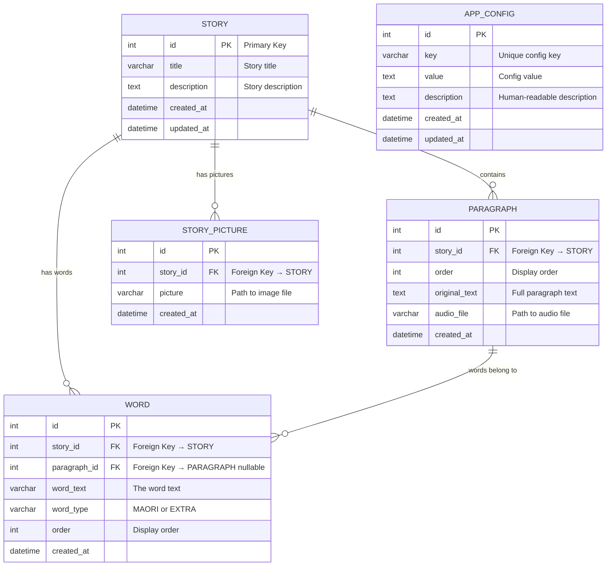
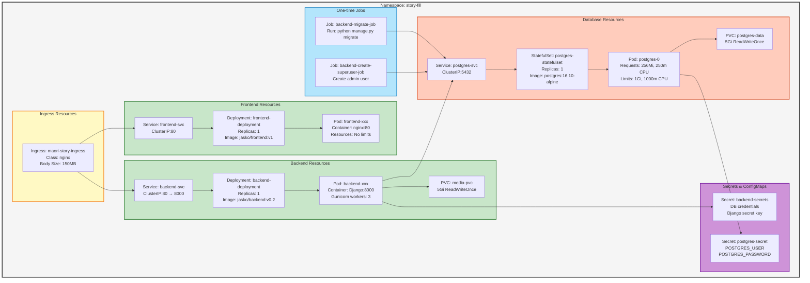

# Architecture Diagrams - Code Snippets

This file contains various architecture diagram codes that can be rendered using different tools.

---

## 1. System Architecture Diagram (Mermaid)

### High-Level 3-Tier Architecture



---

## 2. Request Flow Diagram (Mermaid)

### User Request → Response Lifecycle



---

## 3. CI/CD Pipeline Diagram (Mermaid)

### GitHub Actions Workflow



---

## 4. Database Schema Diagram (Mermaid)

### Entity Relationship Diagram



---

## 5. Kubernetes Resource Diagram (Mermaid)

### K8s Components & Dependencies



---

## 6. Deployment Comparison Diagram (Mermaid)

### Three Deployment Options

```mermaid
graph TB
    subgraph Option1[Option 1: Kubernetes Self-hosted]
        K8sCluster[Kubernetes Cluster<br/>Oracle Cloud / AWS EC2]
        K8sIngress[Nginx Ingress]
        K8sFrontend[Frontend Pods 1-N]
        K8sBackend[Backend Pods 1-N]
        K8sDB[PostgreSQL StatefulSet]
        K8sPVC[PersistentVolumes]
        
        K8sCluster --> K8sIngress
        K8sIngress --> K8sFrontend
        K8sIngress --> K8sBackend
        K8sBackend --> K8sDB
        K8sBackend --> K8sPVC
    end
    
    subgraph Option2[Option 2: Cloud Run + GitHub Pages]
        GHPages[GitHub Pages<br/>Frontend CDN]
        CloudRun[Google Cloud Run<br/>Backend Auto-scale]
        CloudSQL[Cloud SQL<br/>Managed PostgreSQL]
        CloudStorage[Cloud Storage<br/>Media Files]
        
        GHPages -.->|API Calls| CloudRun
        CloudRun --> CloudSQL
        CloudRun --> CloudStorage
    end
    
    subgraph Option3[Option 3: Docker Compose]
        DockerHost[Single Server VPS]
        Nginx[Nginx Container]
        DCFrontend[Frontend Container]
        DCBackend[Backend Container]
        DCDB[PostgreSQL Container]
        Volumes[Docker Volumes]
        
        DockerHost --> Nginx
        Nginx --> DCFrontend
        Nginx --> DCBackend
        DCBackend --> DCDB
        DCBackend --> Volumes
    end

    style Option1 fill:#c8e6c9,stroke:#2e7d32,stroke-width:3px
    style Option2 fill:#fff9c4,stroke:#f57f17,stroke-width:3px
    style Option3 fill:#b3e5fc,stroke:#0277bd,stroke-width:3px
```



---

## 7. Data Flow Diagram - Story Loading (Mermaid)

### Complete User Journey

```mermaid
flowchart TD
    Start([👤 User visits<br/>https://app.example.com/]) --> LoadHTML[Browser requests /<br/>Ingress routes to Frontend]
    LoadHTML --> ReactInit[React App initializes<br/>Renders Menu component]
    ReactInit --> APICall1[useStories hook<br/>GET /api/stories/]
    
    APICall1 --> BackendReceive[Backend receives request<br/>Django view invoked]
    BackendReceive --> DBQuery1[Query PostgreSQL<br/>SELECT * FROM story_story]
    DBQuery1 --> Serialize1[Serialize to JSON<br/>StoriesList Serializer]
    Serialize1 --> Response1[Return JSON response<br/>{stories: [{id, title}, ...]}]
    
    Response1 --> RenderList[React renders story list<br/>NES.css styled buttons]
    RenderList --> UserClick{User clicks story button}
    
    UserClick --> Navigate[React Router navigates<br/>to /story/:id]
    Navigate --> APICall2[StoryPage component<br/>GET /api/stories/:id/]
    
    APICall2 --> DBQuery2[Optimized query<br/>select_related + prefetch_related<br/>Story + Paragraphs + Words]
    DBQuery2 --> Serialize2[Serialize full story data<br/>Nested relationships]
    Serialize2 --> Response2[Return JSON<br/>{story, paragraphs, words}]
    
    Response2 --> RenderStory[React renders:<br/>- Paragraph slots dnd-kit<br/>- Word bank draggables<br/>- Audio players]
    RenderStory --> AudioRequest[Request audio file<br/>GET /media/audio/file.mp3]
    
    AudioRequest --> ServeMedia[Backend serves from<br/>PVC or S3 storage]
    ServeMedia --> PlayAudio[Browser plays audio<br/>HTML5 Audio API]
    
    PlayAudio --> Interact[User interacts:<br/>- Drag words to slots<br/>- Play audio<br/>- Submit answers]
    Interact --> Complete([✅ Story complete])

    style Start fill:#e1f5ff,stroke:#01579b,stroke-width:2px
    style Complete fill:#c8e6c9,stroke:#2e7d32,stroke-width:2px
    style UserClick fill:#fff9c4,stroke:#f57f17,stroke-width:2px
    style DBQuery1 fill:#ffccbc,stroke:#d84315,stroke-width:2px
    style DBQuery2 fill:#ffccbc,stroke:#d84315,stroke-width:2px
```

---

## How to Render These Diagrams

### 1. Mermaid Live Editor (Online)
1. Visit https://mermaid.live/
2. Paste any of the code blocks above
3. Download as PNG/SVG

### 2. VS Code (Local)
1. Install extension: "Markdown Preview Mermaid Support"
2. Open this file in VS Code
3. Press `Cmd+Shift+V` (Mac) or `Ctrl+Shift+V` (Windows)
4. View rendered diagrams

### 3. GitHub Markdown (Automatic)
- GitHub automatically renders Mermaid diagrams in `.md` files
- Just commit this file and view on GitHub

### 4. Command Line (mmdc)
```bash
# Install mermaid-cli
npm install -g @mermaid-js/mermaid-cli

# Render to PNG
mmdc -i diagram.mmd -o diagram.png

# Render to SVG
mmdc -i diagram.mmd -o diagram.svg
```

### 5. Include in Documentation
```markdown
# Your Documentation

## Architecture Overview

\`\`\`mermaid
graph TB
    ... paste diagram code here ...
\`\`\`
```

---

## Alternative Diagram Formats

### PlantUML Version (C4 Model)

If you prefer PlantUML, here's the system context diagram:

```plantuml
@startuml
!include https://raw.githubusercontent.com/plantuml-stdlib/C4-PlantUML/master/C4_Container.puml

Person(user, "Language Learner", "Student learning Māori")

System_Boundary(system, "Maori Story Filler") {
    Container(frontend, "Frontend", "React, nginx", "Provides UI for story interaction")
    Container(backend, "Backend", "Django, Gunicorn", "Provides REST API and admin")
    ContainerDb(database, "Database", "PostgreSQL", "Stores stories, words, media references")
}

System_Ext(cdn, "GitHub Pages", "Serves static frontend")
System_Ext(storage, "Cloud Storage", "Stores media files")

Rel(user, frontend, "Uses", "HTTPS")
Rel(frontend, backend, "Calls API", "JSON/HTTPS")
Rel(backend, database, "Reads/Writes", "SQL/5432")
Rel(backend, storage, "Stores/Retrieves", "S3 API")
Rel_U(cdn, frontend, "Delivers")

@enduml
```

### Draw.io / diagrams.net XML

For manual editing in Draw.io:
1. Visit https://app.diagrams.net/
2. File → Import From → Text
3. Paste Mermaid code
4. Or manually recreate using shapes

---

## Diagram Maintenance

**When to Update**:
- New services added
- Deployment architecture changes
- Technology stack updates
- Major refactoring

**Version Control**:
- Keep diagrams in version control
- Update alongside code changes
- Include in pull request reviews

**Best Practices**:
- Keep diagrams simple and focused
- Use consistent color coding
- Add legends for symbols
- Include version numbers
- Link to implementation docs

---

**Last Updated**: 2026-05-01  
**Maintained By**: Xiang Zhu
