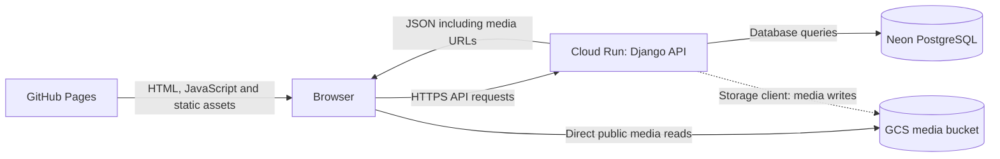

# Current deployment architecture

This page describes the implemented deployment and its verification limits.
The project is a recent infrastructure practice case alongside the author's enterprise experience.

**Pre-migration online baseline checks: 2026-09-27, former repository `jothep/maori-story-fill`.** The public frontend, API read endpoints and a sampled media object were reachable.
The backend release verified at that check was commit `7d8019603925de68306585f701e5eb5a7442f854`, serving 100% of traffic on Cloud Run revision `maori-story-backend-00027-bzj`.
Its [successful delivery run](https://github.com/jothep/maori-story-fill/actions/runs/36299274042) included the post-deployment public API smoke check.
The earlier revision `maori-story-backend-00026-phc` was the credential-rotation baseline and retained the previous application image.

**New frontend verified, 2026-09-28:** [Pages run 36363233923](https://github.com/jothep/story-filler/actions/runs/36363233923) deployed commit `1713b97` to `https://jothep.github.io/story-filler/`. Chrome loaded the menu and, after selection, story 1 text and an image. Full gameplay and audio playback were not checked.

**New backend verified, 2026-09-28:** [run 36363802780, attempt 2](https://github.com/jothep/story-filler/actions/runs/36363802780/attempts/2) passed 11 backend tests, six offline smoke-check tests, authentication, build/scan/push, deployment and the public API smoke check. At 00:58 UTC, ready revision `maori-story-backend-00028-gdm` received 100% of traffic with image tag `1713b97ea6264c50c3321ed3fdd164b594cff5ed`.

Existing Cloud Run, database, bucket and registry identifiers are retained. All runtime environment entries and the runtime service account were unchanged; the runtime specification differed only in image. The [verification summary](evidence/backend-migration-verification.json) records these comparisons, an independent API smoke check and the scoped workflow-log review without private values. Release evidence applies to `1713b97`, independently of later documentation commits. The repository remains private until the owner changes its visibility.

## Request and data flow

GitHub Pages serves the React application; the browser calls Cloud Run directly.
The API returns media URLs and the browser reads those objects directly from GCS.
Pages is not an API proxy, and ordinary media playback does not require an API proxy or signed URL.
The storage integration supports media writes, but the latest online checks covered reads rather than uploads.

Implementation references:

- Frontend API configuration: [frontend/src/config/api.js](../frontend/src/config/api.js).
- Backend storage selection: [settings.py](../backend/maori_story_project/settings.py), using `USE_GCS` and Django `STORAGES`.
- Public media URLs: `GS_QUERYSTRING_AUTH = False` and the configured GCS media URL.
- Runtime configuration: [terraform/main.tf](../terraform/main.tf).

## Runtime choices and constraints

| Component | Implemented choice | Boundary |
| --- | --- | --- |
| Frontend | Static React build deployed to GitHub Pages | Application requests go from the browser to the API |
| API | Cloud Run, minimum 0 and maximum 1 instance | Accepts cold starts and caps instance scaling |
| Container | 1 vCPU, 512 MiB, request-based CPU allocation | No measured throughput claim is made |
| Startup | CPU boost disabled; request timeout configured as 300 seconds | These settings are configuration, not latency measurements |
| Database | External PostgreSQL, documented and deployed as Neon | Database provisioning and recovery policy are outside this Terraform configuration |
| Media | GCS through `django-storages`; public read URLs | Bucket creation and permissions are not defined in this Terraform configuration |

Keeping the database and media outside the container allows application instances to be replaced without relying on their local filesystem for persistent content.
The migration also transfers container scheduling and static hosting responsibilities to managed services.
Database changes, credentials, application correctness and recovery remain project responsibilities.

The explicit instance limit supports a low-traffic cost constraint.
It also limits capacity: this deployment is not configured to expand to 100 instances.
There is no reproducible load-test result, availability measurement or monthly billing evidence included here.
Describe this as a low-cost design that aims to use available allowances, not a guarantee of zero cost.
Provider prices and plan limits must be checked when deploying or estimating costs.

## What Terraform manages

[main.tf](../terraform/main.tf) defines four resources:

1. An Artifact Registry Docker repository.
2. A dedicated Cloud Run runtime service account.
3. The Cloud Run service, resource limits, environment and traffic configuration.
4. The service's public `roles/run.invoker` binding for `allUsers`.

On 2026-09-27, `terraform fmt -check` and `terraform validate` passed; `terraform state list` read the configured GCS backend and recorded exactly these four resources.
This verifies the state inventory, not absence of drift or successful environment recreation. No Terraform plan, apply or restore was performed in this verification.
The GCS state bucket remains a prerequisite rather than a resource created here.
Other external prerequisites include the cloud project and enabled APIs, Neon, the media bucket and its IAM policy, and CI authentication.
GitHub Pages settings and GitHub Actions secrets are also outside this Terraform configuration.
A successful apply alone therefore does not demonstrate that the entire environment can be recreated from an empty account.

The service initially references an existing container image.
A first deployment must establish the registry and make an image available before creating the service.
The older quick-start sequence in [terraform/README.md](../terraform/README.md) needs that bootstrap ordering resolved before it can serve as a verified rebuild procedure.
No clean-environment rebuild is claimed.

### Infrastructure and application ownership

Terraform uses `ignore_changes` for the container image field.
GitHub Actions builds and deploys the application image tagged with the commit SHA.
This allows routine Terraform changes to preserve the version selected by the application pipeline.

The workflow also pushes a mutable `latest` tag; the deployment command selects the SHA tag.
This provides a source-to-release reference, but is not image-digest pinning or a tested rollback procedure.
Terraform itself is not run by the application deployment workflow.

## Delivery pipeline and actual gates

| Workflow | Trigger | Required checks and behavior |
| --- | --- | --- |
| [Backend](../.github/workflows/deploy-backend.yml) | Relevant changes pushed to `main`, or manual dispatch | Django and offline smoke-check tests, image build, Trivy scan, push, Cloud Run update, then public API smoke check |
| [Frontend](../.github/workflows/deploy-frontend.yml) | Relevant changes pushed to `main`, or manual dispatch | ESLint, tests, build, artifact upload, then Pages deployment |
| [Credential scan](../.github/workflows/secret-scan.yml) | Main pushes, pull requests, manual dispatch | Independent Gitleaks workflow scans all fetched history with redacted findings |
| [CodeQL](../.github/workflows/codeql-analysis.yml) | Relevant main pushes, pull requests, schedule, manual dispatch | JavaScript and Python analysis; the analysis step allows failure to continue |
| [Frontend container](../.github/workflows/build-frontend-docker.yml) | Manual dispatch | Lint, tests, container build and scan; optional, separately configured Docker Hub push |

The manual frontend container workflow defaults to no Docker Hub push. Its `DOCKERHUB_USERNAME` and `DOCKERHUB_TOKEN` inputs have not been migrated; publishing that optional image requires separate setup and is not part of the new repository's verified delivery path.

Backend Flake8 and Pylint are advisory because their steps use `continue-on-error`.
Backend tests use SQLite and therefore do not establish PostgreSQL integration behavior.
Trivy blocks HIGH/CRITICAL findings **with available fixes**; unfixed findings are excluded from that gate.
A successful scan is not a claim of zero vulnerabilities.

The application test workflows currently have no pull-request trigger.
The backend now runs [a smoke check](../scripts/smoke-check.py) after updating the service.
It validates HTTP/JSON responses, a non-empty story list, one story detail with paragraphs and a word bank, and the configuration endpoint, using bounded retries.
The [backend run for `7d80196`](https://github.com/jothep/maori-story-fill/actions/runs/36299274042) passed 11 Django tests, six offline smoke-check tests, image build, Trivy scan, push, deployment and the public API smoke check.
A separate local run against production also passed.
A failure marks the workflow failed after deployment; it does not roll back the service.
Database migration and automatic rollback remain outside the workflow. Media playback, writes and a full game walkthrough are outside the smoke check.
The credential scan is a separate workflow, not a dependency of deployment; no required branch-protection gate is claimed.
See [the verification record](verification.md) for dated execution evidence.

## Identity, secrets and state

The Cloud Run service uses a named runtime service account.
The Terraform configuration does not establish all permissions held by that account or the CI identity, so it does not prove least-privilege IAM across the environment.
The API service is publicly invokable; administrative authentication is handled by Django.

The backend workflow retains the former repository's service-account JSON key authentication through the `GCP_CREDENTIALS` GitHub Actions secret and `credentials_json`. The owner configured that secret manually in the new repository, and the new release authenticated successfully; the migration did not introduce a new CI identity or change IAM roles. Workload Identity Federation is not configured, and this is not keyless authentication. The migration record distinguishes secret setup from a successful new-repository release.

Database configuration and the Django signing key are injected as environment variables from sensitive Terraform inputs.
There is no checked-in Secret Manager resource or Cloud Run Secret Manager reference.
Marking an input `sensitive` controls its display; it does not remove the value from Terraform state.
State, state history, saved plans, local variable files and backup copies must remain private.
No credential values belong in source, examples, screenshots or deployment evidence.

## Evidence and status

| Item | Status and limits |
| --- | --- |
| New frontend release | Commit `1713b97`; new-repository Pages deployment and Chrome menu-to-story text/image check passed on 2026-09-28 |
| New-repository scans | Two Git-history credential-scan runs and one CodeQL workflow completed successfully; fresh-clone Gitleaks and 20-known-value review found no matches/findings; see the migration record for scope |
| New-repository backend release | Run 36363802780 attempt 2 passed; revision `maori-story-backend-00028-gdm`, image `1713b97`, 100% traffic at the 2026-09-28 check |
| Backend configuration comparison and log review | Environment entries/runtime identity unchanged; runtime specification changed only in image. Gitleaks and known-value log checks found no findings or matches within their scope |
| Legacy frontend, API reads and sampled GCS object | Reachable during the 2026-09-27 checks; this is a point-in-time check |
| Pre-migration backend release | Commit `7d80196`; revision `maori-story-backend-00027-bzj`, image tagged with that commit, 100% traffic |
| Earlier credential-rotation baseline | Revision `maori-story-backend-00026-phc` retained the application image deployed before the cleanup |
| Pre-migration frontend release | Commit `a309a63`; Pages delivery completed successfully |
| API smoke check | Six offline tests, local production checking and the post-deployment GitHub Actions step passed |
| Credential-scan workflow | Successful independent runs for `a309a63` and `7d80196`; not a deployment dependency |
| Historical backend and frontend releases | Successful Actions records exist; they refer to the source history used at that time |
| Uploads, capacity, failover and restore | Not verified by the latest read-only checks |
| Terraform configuration and remote state | Formatting and validation passed; GCS state inventory confirmed four declared resources; no plan/apply/restore in this verification |
| Complete environment rebuild | Not yet demonstrated; state inventory is not a drift or recovery test |

Pre-migration release evidence from the former private repository: [backend `7d80196`](https://github.com/jothep/maori-story-fill/actions/runs/36299274042), [frontend `a309a63`](https://github.com/jothep/maori-story-fill/actions/runs/36298824448), and credential scans for [`a309a63`](https://github.com/jothep/maori-story-fill/actions/runs/36298820622) and [`7d80196`](https://github.com/jothep/maori-story-fill/actions/runs/36299274040).
The former repository remains private because old commit content was still retrievable there. This repository carries forward the cleaned history; its publication and deployment status are tracked in the migration record. Old private Actions links may be inaccessible to public readers; the [aggregate evidence snapshot](evidence/README.md) records their scope.

Historical release records: [backend](https://github.com/jothep/maori-story-fill/actions/runs/25036589237) and [frontend](https://github.com/jothep/maori-story-fill/actions/runs/25902475995).
Credential removal rewrites Git history, so an older run's recorded commit may differ from the corresponding commit in the cleaned repository.
Keep the historical run date and the checked behavior explicit; do not relabel it as a run of the cleaned source.

## Historical architecture and next steps

The Kubernetes manifests are retained as an earlier project stage, documented in [the architecture overview](ARCHITECTURE.md).
The author's [original migration article](https://medium.com/@shelldry325/from-on-premises-kubernetes-to-zero-cost-serverless-architecture-a-practical-guide-to-cloud-70e68304e835) reports using that environment; it has not been redeployed during this review.

The smoke check is implemented and verified both locally and in the successful backend deployment workflow for `7d80196`.
Potential follow-up work includes a verified bootstrap procedure and a documented rollback exercise.
PR application checks and Workload Identity Federation are possible later improvements. Neither is part of this repository migration.
The remaining exercises above are proposed work, not completed capabilities.
See [architecture diagrams](architecture-diagrams.md) for the current and historical views, and [the local platform lab](local-platform-lab.md) for Compose, Kubernetes and prototype implementation details.
