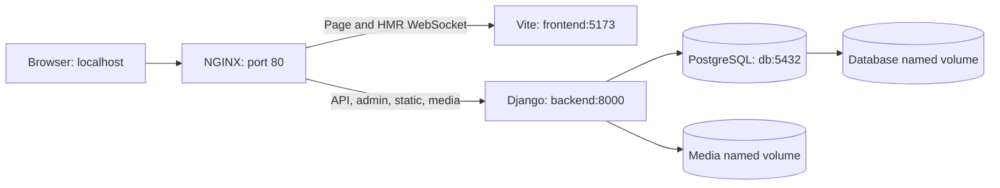

# Local development and platform lab

This project retains the environments used to move from a Django/React prototype to container composition, Kubernetes manifests and managed hosting.
The local work makes service boundaries, startup order, routing, persistent state and operational tasks visible in source.
It complements the [cloud architecture](architecture-production-gcp.md); it is not an additional production platform.

## What each environment demonstrates

| Environment | Implementation | Evidence boundary |
| --- | --- | --- |
| Early prototype | `demo/`: host-run Django and React; Compose starts PostgreSQL only | Source retained; prototype tests are empty scaffolds; not rerun in this review |
| Development Compose | NGINX, Vite, Django and PostgreSQL with source mounts and named volumes | Configuration parsed; full container startup not rerun |
| Production-style Compose | Gunicorn, built frontend, NGINX static/media serving and persistent volumes | An alternative deployment configuration, not the current public production service |
| Local Kubernetes | Services, Deployments, PostgreSQL StatefulSet, PVCs, Ingress, Secret references and Jobs | Implemented; the original article reports the historical environment; not redeployed now |
| Host-run checks | Backend, frontend and smoke-check test suites | 11 backend, 6 frontend and 6 smoke-check tests passed; scope below |

The Docker daemon was unavailable during the review, so parsing Compose files is not evidence of image builds, startup or working container networking.
No existing local cluster was used to claim Kubernetes verification.
Terraform validation and its four-resource GCS state inventory were checked separately; neither verifies a local cluster or complete environment rebuild.
See [the dated verification record](verification.md) for execution status.

## Development Compose: the feedback loop

[`docker-compose.dev.yml`](../docker-compose.dev.yml) joins four services on one bridge network.
NGINX resolves the Compose service names `frontend` and `backend`; the backend reaches PostgreSQL as `db`.
The browser uses the NGINX host port, not those internal service names.



The frontend and backend source directories are bind-mounted for editing without rebuilding on each change.
The frontend has a separate `node_modules` volume; [NGINX](../nginx.dev.conf) forwards WebSocket upgrades for Vite HMR.
[`start-dev.sh`](../backend/start-dev.sh) waits for a database connection, runs migrations, collects static files, then starts Django's development server.
Compose also waits for the database health check before starting the backend.
These are two concrete startup checks, not proof that every application dependency is healthy.

The browser API base is empty so `/api/` stays on the NGINX origin.
This was corrected from a host `localhost:8000` setting that bypassed NGINX even though the backend port was not published.
The correction is implemented and configuration-checked; the complete container path still needs a live run.
Open the frontend at **http://localhost/story-filler/**, matching the Vite base and React router basename.

### Startup sequence to verify with Docker running

Run from the repository root. Generate the local environment once; the generator refuses to replace an existing file.

```bash
python3 scripts/init-local-env.py
docker compose -f docker-compose.dev.yml config --quiet
docker compose -f docker-compose.dev.yml up --build -d
docker compose -f docker-compose.dev.yml ps
docker compose -f docker-compose.dev.yml exec backend python manage.py createsuperuser
```

The generator writes ignored, owner-only `.env` configuration and does not display credentials.
Create the administrator interactively, then use `http://localhost/admin/` to add local content.
A new database contains no story data: neither migrations nor container startup imports the public deployment's content.
The API smoke check deliberately fails on an empty story list; run it after preparing a complete local story:

```bash
python3 scripts/smoke-check.py --base-url http://localhost
docker compose -f docker-compose.dev.yml exec backend python manage.py test
docker compose -f docker-compose.dev.yml logs --tail=50 backend nginx
```

The second command exercises Django against the local PostgreSQL setup and has not been rerun during this review.
Named volumes preserve database and uploaded-media content when containers are replaced; they are not backups.
`docker compose -f docker-compose.dev.yml down` stops the lab without requesting volume deletion.
The development database publishes host port 5432; do not run it alongside the prototype database on that port.

### Local filesystem permissions

The backend image runs as a non-root `app` user, while development Compose bind-mounts the host's `backend/` over `/app`. Image-layer ownership does not change a host bind mount. On Linux, a different host UID can prevent Django from writing logs or collected static files. The media volume target is also not explicitly created and assigned to `app` during the image build, so ownership on first volume initialization needs checking in both Compose variants.

These are unresolved reproduction gaps. Before treating the startup sequence as verified, check writes as the container's application user and test an administrator media upload. A local setup fix should explicitly manage writable directories and UID/volume ownership; configuration parsing alone cannot establish that these operations work.

## Production-style Compose: different process and storage choices

[`docker-compose.prod.yml`](../docker-compose.prod.yml) describes a single-host alternative to Kubernetes or Cloud Run.
It does not define the currently deployed cloud service.

| Concern | Development variant | Production-style variant |
| --- | --- | --- |
| Backend process | Django runserver with source bind mount | Gunicorn with gevent workers; no source bind mount |
| Frontend | Vite dev server and HMR | Multi-stage build, then `serve` on port 3000 |
| Media/static files | NGINX forwards to Django | NGINX reads shared volumes directly |
| Database access | Host port published for local tools | Database reachable through the Compose network |
| Schema changes | Startup script runs migrations | Operator must run the migration command |
| Logs | Container output and application files | Container log rotation settings are included |

The chosen frontend is [frontend/Dockerfile](../frontend/Dockerfile), matching the port-3000 upstream in [nginx.prod.conf](../nginx.prod.conf).
The separate [Dockerfile.nginx](../frontend/Dockerfile.nginx) is used by the manual frontend-image workflow; it is not the image selected by this Compose file.
NGINX now redirects `/` to `/story-filler/` and strips that prefix before proxying frontend assets to the root of `serve`.
This corrects the checked-in path mismatch; Compose parsing passed, but container-side `nginx -t` and browser asset loading are still unverified.
Publishing port 443 does not enable HTTPS: the SSL server block is commented out.
The NGINX `/health` response checks only that proxy process, not Django or PostgreSQL.

For an isolated lab, the intended order is: review private configuration, parse Compose, build images, start the database, run migrations and collectstatic, then start application and proxy services.
The maintenance commands are explicit:

```bash
docker compose -f docker-compose.prod.yml config --quiet
docker compose -f docker-compose.prod.yml build
docker compose -f docker-compose.prod.yml up -d db
docker compose -f docker-compose.prod.yml run --rm backend python manage.py migrate --noinput
docker compose -f docker-compose.prod.yml run --rm backend python manage.py collectstatic --noinput
docker compose -f docker-compose.prod.yml up -d
```

This sequence is not yet an end-to-end verified rebuild procedure.
Keep development and production-style lab runs separate: both publish host port 80.

## Kubernetes: expressing the same boundaries through cluster resources

The [`Infra/`](../Infra/) implementation replaces Compose service discovery and volumes with Services, workloads and PVCs.
The Ingress routes `/api/`, `/admin/`, `/static/` and `/media/` to the backend and other paths to the frontend.
The PostgreSQL StatefulSet requests persistent storage and defines CPU/memory settings plus readiness and liveness probes.
The backend mounts a separate media PVC.

Operational responsibilities are separated into a [migration Job](../Infra/backend-migrate-job.yaml) and an [administrator-creation Job](../Infra/backend-create-superuser-job.yaml).
The administrator Job checks whether the username exists before creating it.
[Network](../Infra/debug-pod.yaml) and [PostgreSQL client](../Infra/psql-test-pod.yaml) Pods preserve concrete troubleshooting tools.
These files demonstrate more than container packaging: they express lifecycle order, internal connectivity, state placement and operational tasks.

### Prerequisites and application order

Select a dedicated lab context explicitly; never assume the current `kubectl` context is this project.
A cluster, NGINX Ingress controller, usable storage class, namespace and available application image tags are prerequisites.
The manifests retain historical tags, including frontend `v1`; the manual image workflow publishes `latest` and SHA tags instead.
The current NGINX frontend Dockerfile now copies `dist` under `/usr/share/nginx/html/story-filler/` and enables the checked-in configuration for `/story-filler/`, including the SPA fallback. The Ingress forwards that path unchanged. This is a source-level migration fix; it has not been built or exercised in a cluster.
Before rebuilding the lab, select a newly built image from this source and update the local manifest image reference. The historical `v1` tag is retained as evidence of the earlier design; its contents are not established by the current Dockerfile.
Use either the PostgreSQL StatefulSet path below or the separate Helm values file, not both together.

Prepare private environment files for the referenced Secrets; their values are not supplied in this repository:

| Secret name | Required inputs |
| --- | --- |
| `postgres-secret` | `POSTGRES_USER`, `POSTGRES_PASSWORD` |
| `maori-story-backend-secrets` | Matching database user/password, `POSTGRES_DB`, `POSTGRES_HOST`, `POSTGRES_PORT`, and the application's `SECRET_KEY` |
| `django-superuser-creds` | `ADMIN_USER`, `ADMIN_PASS`, `ADMIN_EMAIL` |

The database name and Service host must match `Infra/postgres-deployment.yaml`.
Create these Secrets from the private files with `kubectl create secret generic --from-env-file`, using the selected context and `story-fill` namespace.
A Secret reference does not establish cluster-side encryption at rest or automated rotation.

After preparing the context, namespace, Secrets and images, the StatefulSet path is:

```bash
: "${LAB_CONTEXT:?Set LAB_CONTEXT to a dedicated local lab context}"
kubectl --context "$LAB_CONTEXT" apply -f Infra/postgres-deployment.yaml -f Infra/pvc.yaml
kubectl --context "$LAB_CONTEXT" -n story-fill rollout status statefulset/postgres-statefulset
kubectl --context "$LAB_CONTEXT" apply -f Infra/backend-migrate-job.yaml
kubectl --context "$LAB_CONTEXT" -n story-fill wait --for=condition=complete job/maori-story-backend-migrate-job --timeout=120s
kubectl --context "$LAB_CONTEXT" apply -f Infra/backend-deployment.yaml -f Infra/frontend-deployment.yaml
kubectl --context "$LAB_CONTEXT" apply -f Infra/ingress.yaml
kubectl --context "$LAB_CONTEXT" apply -f Infra/backend-create-superuser-job.yaml
kubectl --context "$LAB_CONTEXT" -n story-fill get pods,services,ingress,pvc,jobs
```

Verify workload readiness and Ingress reachability before treating this sequence as successful.
Applying an already-completed Job does not automatically execute it again; reruns need an explicit lifecycle decision.
All three primary workloads are single replicas. Frontend/backend probes, autoscaling, Ingress TLS and ArgoCD Application definitions are not included.
The [original article](https://medium.com/@shelldry325/from-on-premises-kubernetes-to-zero-cost-serverless-architecture-a-practical-guide-to-cloud-70e68304e835) reports running the earlier environment; this review did not repeat that exercise.

## Prototype: why `demo/` remains useful

The prototype shows the earlier application contract: a `Story` holds `full_text`, related words have translations, and DRF provides list/detail endpoints.
Its React/MUI UI fetches stories from the host Django server and displays the selected story.
It is useful for explaining incremental development before the richer paragraph, media and word-bank model in the maintained backend.
It is not a second platform component, a production service or the same API contract as the current game.

There is no prototype README or dedicated Python dependency manifest.
Root `Requirements.txt` contains project requirements, not pip dependencies.
The following reconstruction uses the maintained backend dependency set; prototype compatibility has not been verified by running it:

```bash
python3 scripts/init-local-env.py --output demo/.env
python3 -m venv demo/.venv
demo/.venv/bin/pip install -r backend/requirements.txt
docker compose --env-file demo/.env -f demo/docker-compose.yml up -d
set -a
. ./demo/.env
set +a
demo/.venv/bin/python demo/manage.py migrate
demo/.venv/bin/python demo/manage.py createsuperuser
demo/.venv/bin/python demo/manage.py runserver 127.0.0.1:8000
```

Wait for PostgreSQL to become ready before migrating; prototype Compose has no database health check.
In another terminal, run `npm ci` then `npm run dev` inside `demo/frontend/maori-story-frontend/` and open `http://localhost:5173/`. This separate prototype retains its root base and fixed host API address; it does not use the maintained application's `/story-filler/` prefix.
The prototype requires host environment variables explicitly; its settings do not load the `.env` file themselves.
Populate its own database through its Django admin. Do not point it at production data.
Both prototype `tests.py` files are scaffolds, so retaining them is not evidence of prototype test coverage.

## What the fast checks establish

The maintained backend's [11 tests](../backend/core/tests.py) cover basic models, public read endpoints and local media URL behavior.
The frontend's [story tests](../frontend/src/App.test.jsx) and [menu tests](../frontend/src/pages/Menu.test.jsx) cover loading, failure handling and audio configuration using mocked requests/audio.
Run frontend lint, tests and build with the scripts in [package.json](../frontend/package.json).
The [six smoke-check tests](../scripts/smoke_check_test.py) exercise response validation and bounded failure handling; `python3 -m unittest discover -s scripts -p 'smoke_check_test.py'` runs offline.
These checks provide quick feedback, while PostgreSQL integration, container networking, browser gameplay and Kubernetes recovery require separate running-environment checks.
